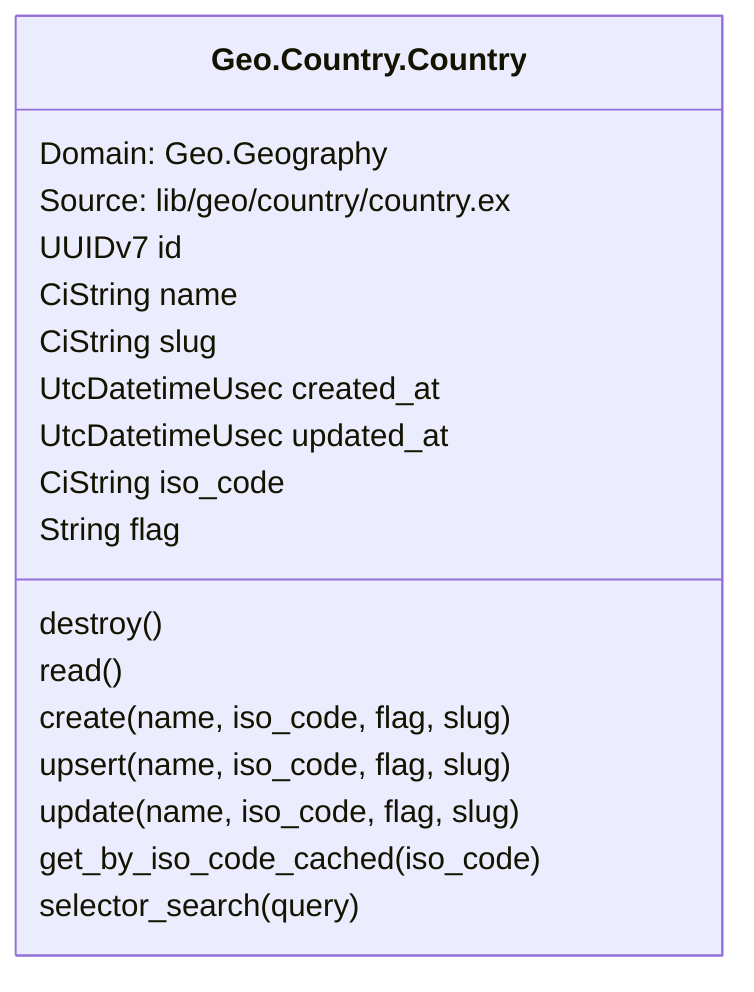
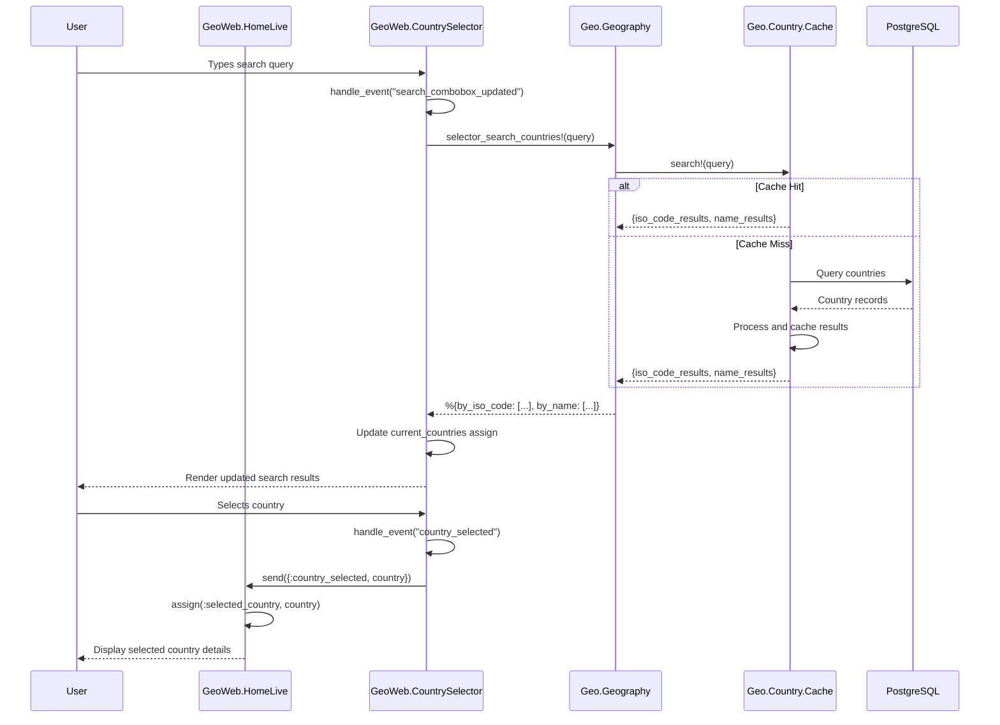
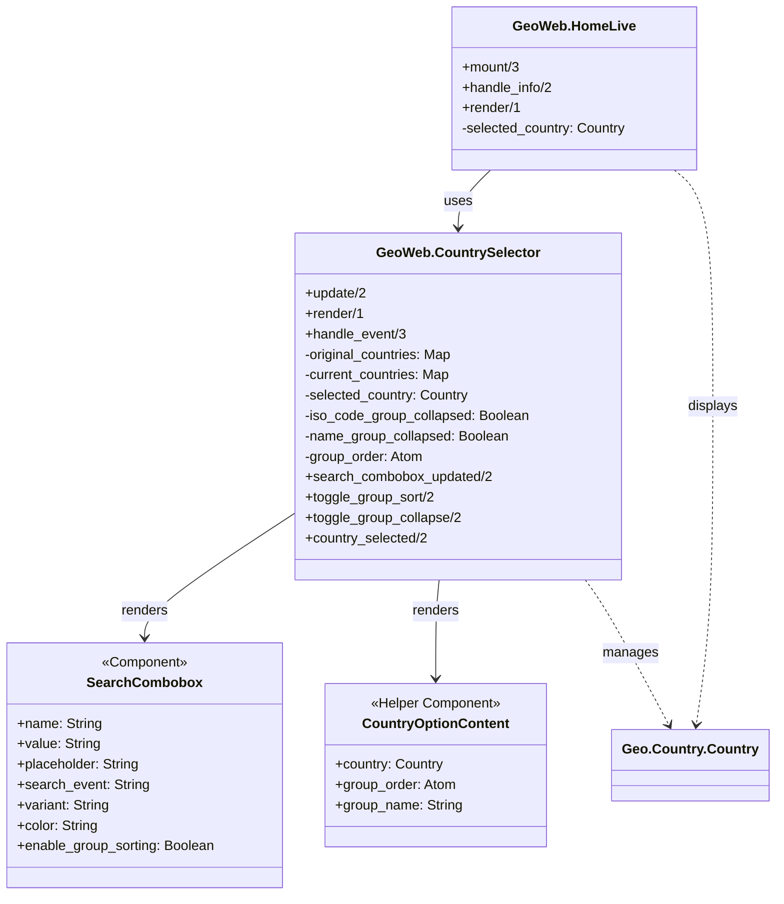
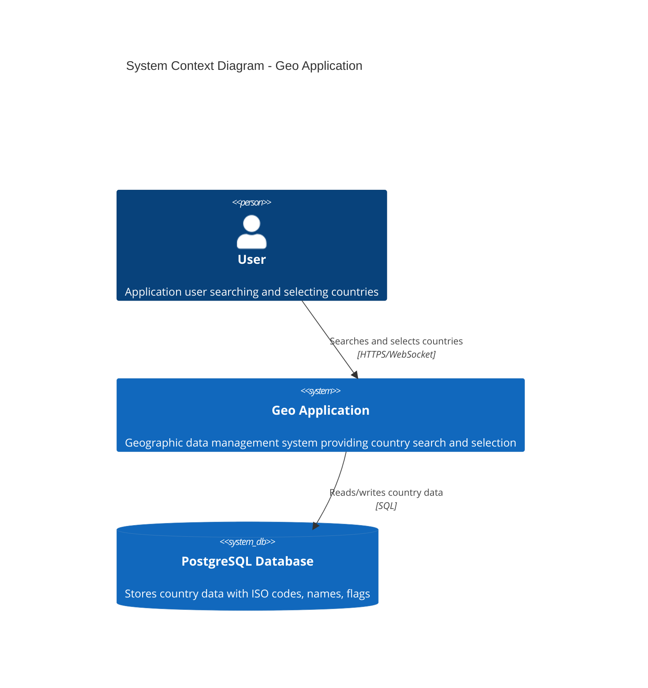
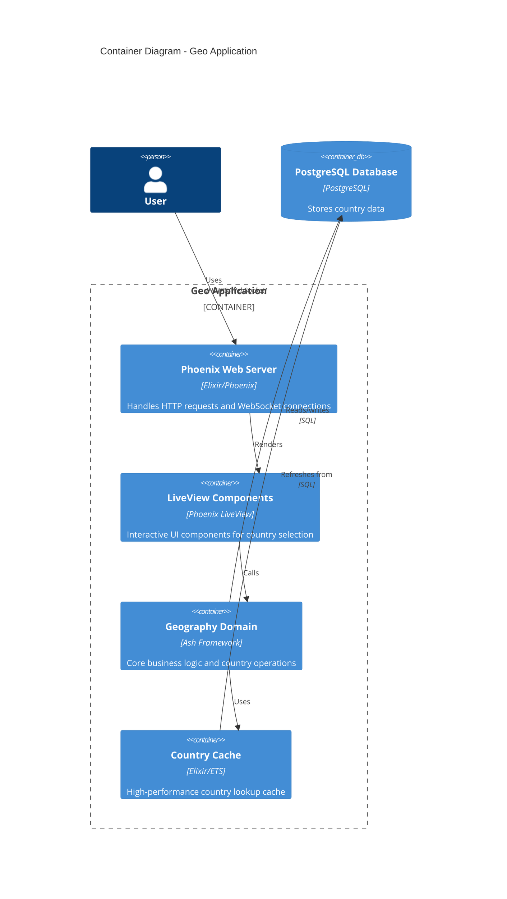
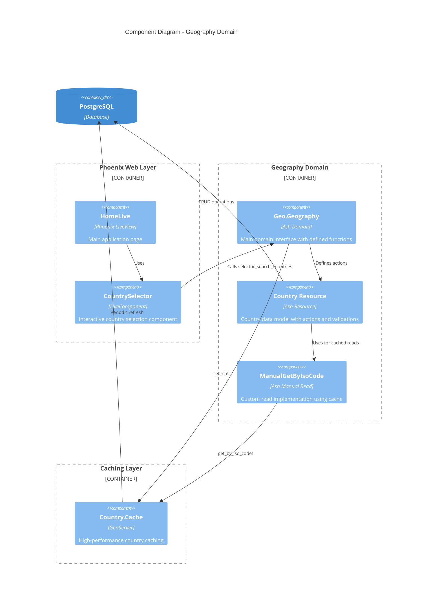

# Geo - Geographic Data Management System

## Project Overview

Geo is a modern Elixir/Phoenix application built with the Ash Framework that provides efficient geographic data management and search capabilities. The application focuses on country data management with high-performance caching and intelligent search functionality designed for user interfaces.

### Architecture

The application follows a clean domain-driven architecture using Ash Framework:

- **Domain Layer**: `Geo.Geography` - Core business logic and operations
- **Resource Layer**: `Geo.Country.Country` - Data models and validations  
- **Web Layer**: Phoenix LiveView components for interactive UI
- **Caching Layer**: High-performance country lookup and search caching

### Key Features

- **Country Management**: Full CRUD operations for country data (ISO codes, names, flags, slugs)
- **Intelligent Search**: Multi-criteria search with prioritized results (ISO codes, names)
- **High-Performance Caching**: Sub-millisecond country lookups via `Geo.Country.Cache`
- **Interactive UI**: Real-time search with grouped, sortable results
- **Upsert Operations**: Efficient create-or-update operations using unique identities

### Requirements

- PostgreSQL

### Technology Stack

- **Backend**: Elixir
- **Frontend**: Phoenix LiveView with Mishka Chelekom components
- **Database**: PostgreSQL with Ecto/AshPostgres
- **Application**: Ash Framework for domain modeling

## Usage

1. Install PostgreSQL
2. `mix setup` to install and setup dependencies
3. `mix phx.server` or inside IEx with `iex -S mix phx.server`

Now you can visit [`localhost:4000`](http://localhost:4000) from your browser.

Ready to run in production? Please [check our deployment guides](https://hexdocs.pm/phoenix/deployment.html).

## Architecture Diagrams

### Ash Resources Overview

### Country Search Sequence Diagram

### UI Components Class Diagram

### C4 Architecture Diagrams

#### Level 1: System Context

#### Level 2: Container Diagram

#### Level 3: Component Diagram

## Domain Model

### Geo.Geography Domain

The main domain provides these key operations:

- `list_countries/0` - Lists all countries
- `selector_search_countries/1` - Intelligent search for UI components
- `get_country_iso_code_cached/1` - High-performance country lookup by ISO code
- `create_country/1`, `update_country/1`, `upsert_country/1` - Country management

### Geo.Country.Country Resource

Core attributes:
- `id` (UUIDv7) - Primary key
- `name` (CiString) - Country name
- `iso_code` (CiString) - ISO country code (2-3 chars, unique)
- `flag` (String) - Unicode flag emoji
- `slug` (CiString) - URL-friendly identifier
- `created_at`, `updated_at` - Timestamps

Key features:
- Unique constraints on `iso_code` and `slug`
- Automatic slug generation from name
- Upsert capability using ISO code identity
- Cached search operations for performance

## Performance Features

### Caching Strategy
- `Geo.Country.Cache` provides sub-millisecond lookups
- Automatic cache refresh every 10 minutes
- Intelligent search with prioritized results:
  1. Exact ISO code matches
  2. Partial ISO code matches (≤3 chars)
  3. Exact name matches
  4. Names starting with query
  5. Names containing query

### UI Optimizations
- Real-time search with debouncing
- Grouped results (by ISO code and name)
- Sortable groups with multiple sort orders
- Collapsible groups for better UX
- Efficient re-rendering with LiveView
